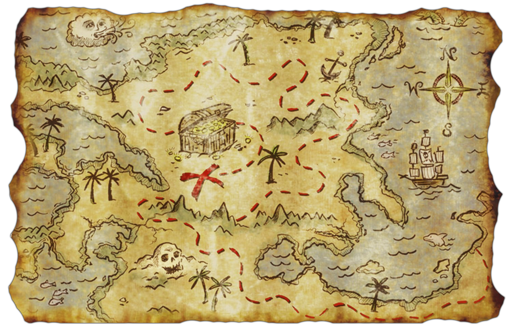
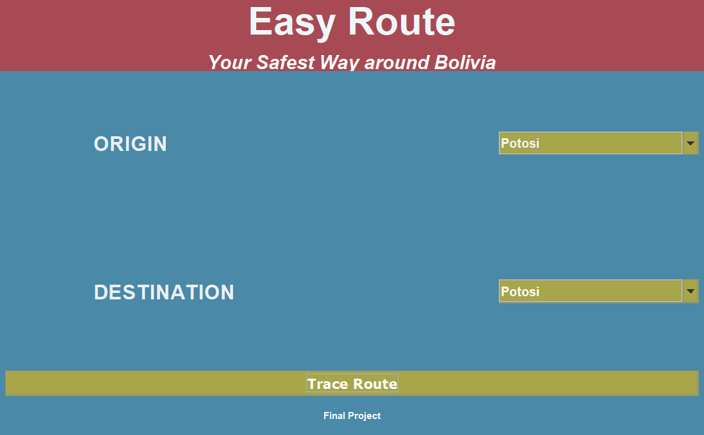
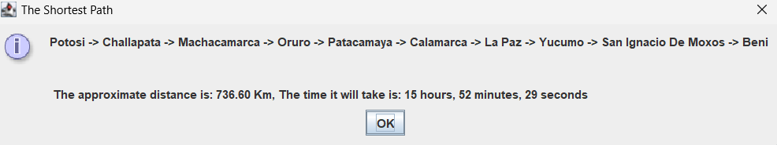

![Maintained][Maintained-shield]
![Forks][Forks-shield]

<!-- PROJECT LOGO -->
 

  

<h3 align="center">Easy Route</h3>

  

    Final project of the third module built with all our hearths.  
    A project built by <a href="https://github.com/waltervaquera"><strong>Walter</strong></a> and
    <a href="https://github.com/NicoZela23"><strong>Nico</strong></a>
     
    <a href="https://github.com/NicoZela23/final-project-module3"><strong>Explore the docs »</strong></a>
     
     
    <a href="https://github.com/NicoZela23/final-project-module3">View Demo</a>
    ·
    <a href="https://github.com/NicoZela23/final-project-module3/issues">Report Bug</a>
    ·
    <a href="https://github.com/NicoZela23/final-project-module3/issues">Request Feature</a>
  

<!-- TABLE OF CONTENTS -->

  
Table of Contents

  <ol>
    <li>
      <a href="#about-the-project">About The Project</a>
      <ul>
        <li><a href="#development-environment">Development Environment</a></li>
      </ul>
    </li>
    <li>
      <a href="#getting-started">Getting Started</a>
    </li>
    <li><a href="#usage">Usage</a></li>
      <ul>
        <li><a href="#trace-route">Trace Route</a></li>
        <li><a href="#output">Output</a></li>
        <li><a href="#data-structures-applied">Data Structures applied</a></li>
        <li><a href="#routes-document">Routes Document</a></li>
        <li><a href="#Conclusions">Conclusions</a></li>
      </ul>
  </ol>

<!-- ABOUT THE PROJECT -->
## About The Project

🎉 Ladies and gentlemen, adventurers and road warriors alike! 🚗 Are you someone who thrives on the thrill of the open road? Do you have Bolivia marked as your next destination on your travel bucket list? But hey, let's be honest, who needs Google Maps, right? 🗺️ Well, fear not, because we've got just the solution for you!

Introducing Easy Route – your ultimate travel companion designed to tackle all your navigation dilemmas with ease! 🌍 Picture this: cruising through unfamiliar territories without a map... sounds like a recipe for getting lost, doesn't it? 🤷‍♂️ But fret not! Our ingenious desktop application is here to save the day, serving up lightning-fast and foolproof routes to every corner of Bolivia and beyond!

With just a few clicks, Easy Route becomes your trusty guide, effortlessly generating safe and efficient paths to your desired destinations. 🛣️ Worried about missing that hidden gem or iconic landmark? Don't be! We've got you covered, providing not only your next stop but also crucial details like distance and travel time.

So why wait? Say goodbye to the stress of navigating the unknown and embrace the adventure with Easy Route! 🌟 Whether you're a seasoned explorer or a newbie wanderer, let us pave the way for your unforgettable journey. Download Easy Route now and let the adventures begin! 🚀

Table of Contents:
* How to use it
* Data structures applied
* How it is built
* Conclusions and Future plans

While it's possible that not every town and possible route around Bolivia is covered, we hope this project can grow and we will cover all towns around Bolivia to ensure a safe trip to our users

Use the `Run.main` button to see it by yourself.

### Development Environment
* [![Java][Java]][Java-url]
* [![IntelliJ IDEA][IntelliJ]][IntelliJ-url]
* [![Git][Git]][Git-url]
* [![Powershell][Powershell]][Powershell-url]
* [![Github][Github]][Github-url]

<!-- GETTING STARTED -->
## Getting Started

To run this project, ensure you have Java 17 or upper installed along with any Integrated Development Environment (IDE). Simply execute a local build, and everything will be up and running smoothly.

Clone this project and test it by yourself!

<!-- USAGE EXAMPLES -->
## Usage

The project presented here was developed exclusively in Java, with a focus on providing a user-friendly interface that is intuitive and accessible to all. We have crafted a seamless user experience using **_Swing_** for all UI elements, coupled with the dynamic form creation capabilities of **_IntelliJ IDEA_**.  

**Having as options this way of choice using a selector of origin and destination**:
> 

**And the same selector to select your destination**
> 

Each selector option provides an extensive array of origins and destinations, totaling 39 in all. This comprehensive selection allows users to explore every possible route for traveling around Bolivia. Feel free to experiment with unique combinations, often involving distant towns, to discover new and intriguing routes. 

### Trace Route
The focal point of the program lies in a key feature: the button enabling the application to trace your favorite routes using the Dijkstra algorithm. Detailed documentation on this algorithm will be provided later. Upon pressing this button, the program displays an output frame presenting timestamps and approximate distances. These values are derived from the weight assigned in the graph, which will also be elaborated on in subsequent explanations.
> 
### Output
After selecting your origin and destination, a dedicated frame will present all the valuable information pertaining to your travel.
> 

## Data Structures applied
The entire logic underpinning this project relies on weighted graphs, involving the utilization of Nodes, Edges, and the graph structure itself. We opted for a straightforward approach in implementing this project, harnessing the power of Java's libraries, including linked lists, Maps, and HashMaps. Extensive documentation and tutorials served as invaluable resources throughout the creation process.

Our decision to employ the Dijkstra algorithm was twofold: first, for educational purposes, as it offers a rich learning experience; second, for its efficiency in providing optimal solutions for route calculations.
### Routes Document
If you want to see the document where all the routes where traced and managed the weight you access here <a href="https://docs.google.com/document/d/1VkbZLypJxjx1OGYmw8B20KnZOu4NPv3lK0Epu9MlLio/edit?usp=sharing"><strong>Routes Document</strong></a> 

### Conclusions
Creating this project may have initially seemed straightforward in our minds, as we anticipated finding much of the necessary logic readily available on the internet. However, the reality proved to be quite different. We encountered numerous challenges along the way, including sifting through misleading information, grappling with flawed repositories, and conducting a plethora of tests, both individually and collaboratively as a team.

Despite the hurdles, our relentless dedication and countless hours of practice ultimately culminated in the development of this application. We are thrilled to present the final result—an achievement that stands as a testament to our perseverance and unwavering commitment to excellence.

(<a href="#readme-top">back to top</a>)

[Maintained-shield]: https://img.shields.io/badge/Maintained%3F-yes-green.svg
[Forks-shield]: https://img.shields.io/github/forks/NicoZela23/datastructure-nicolas.svg
[Java]: https://img.shields.io/badge/Java-ED8B00?style=for-the-badge&logo=openjdk&logoColor=white
[Java-url]: https://www.java.com/es/
[IntelliJ]: https://img.shields.io/badge/Intellij%20Idea-000?logo=intellij-idea&style=for-the-badge
[IntelliJ-url]: https://www.jetbrains.com/idea/
[Git]: https://img.shields.io/badge/GIT-E44C30?style=for-the-badge&logo=git&logoColor=white
[Git-url]: https://git-scm.com/
[Powershell]: https://img.shields.io/badge/powershell-5391FE?style=for-the-badge&logo=powershell&logoColor=white
[Powershell-url]: https://www.microsoft.com/store/productId/9MZ1SNWT0N5D?ocid=pdpshare
[Github]: https://img.shields.io/badge/GitHub-100000?style=for-the-badge&logo=github&logoColor=white
[Github-url]: https://github.com/

